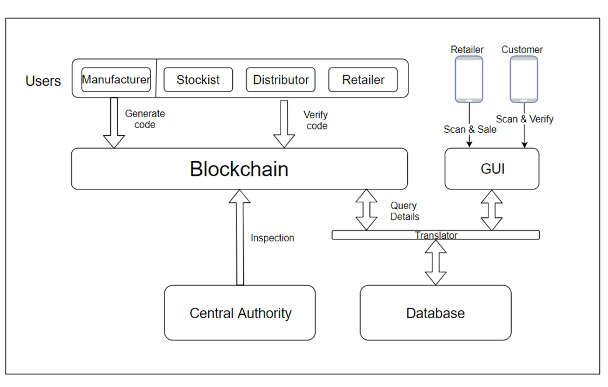
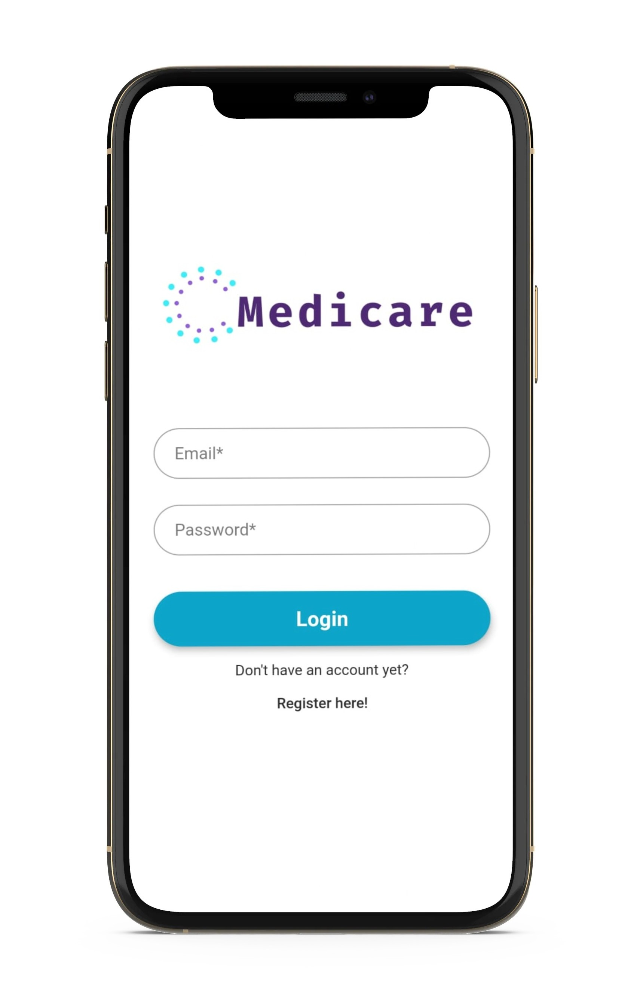
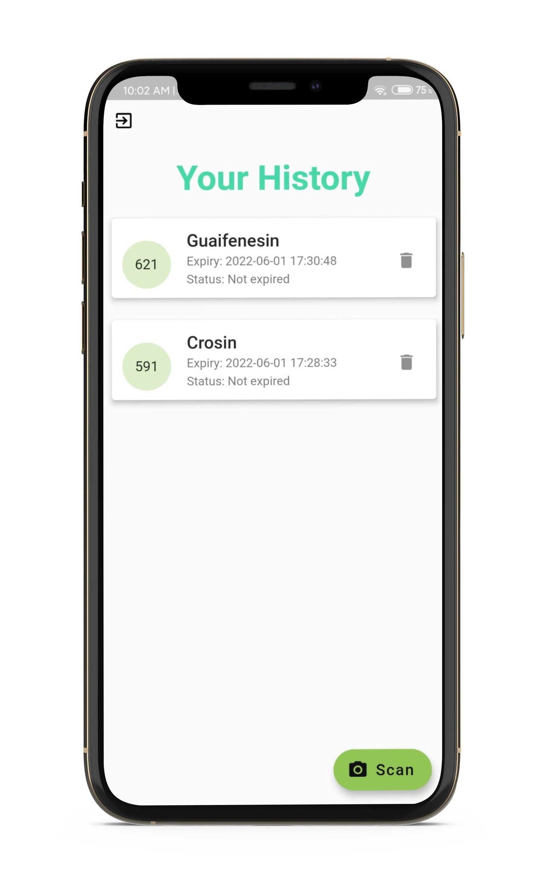
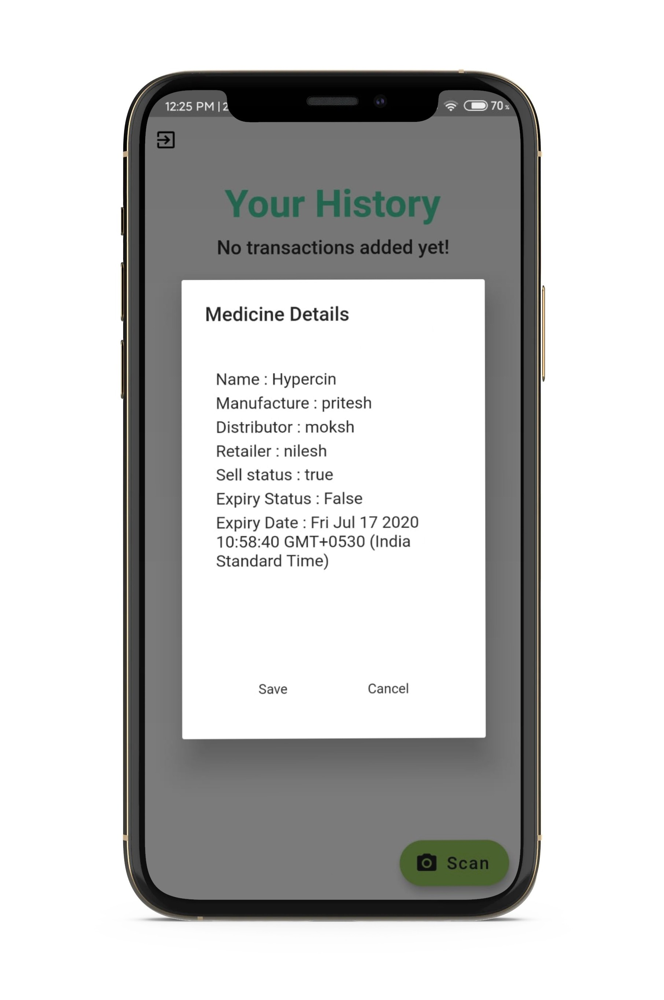
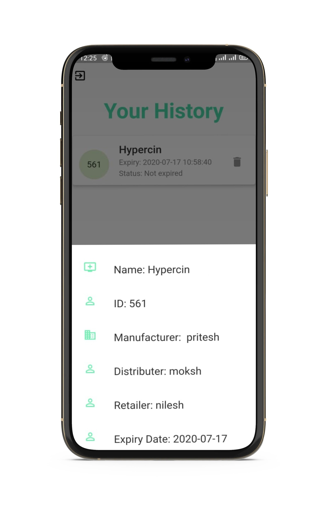
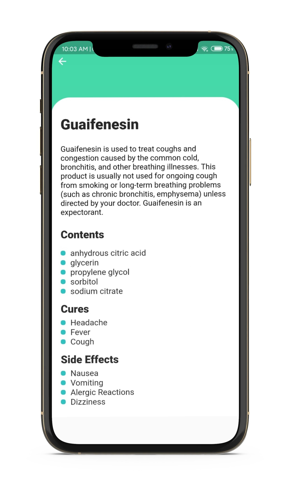
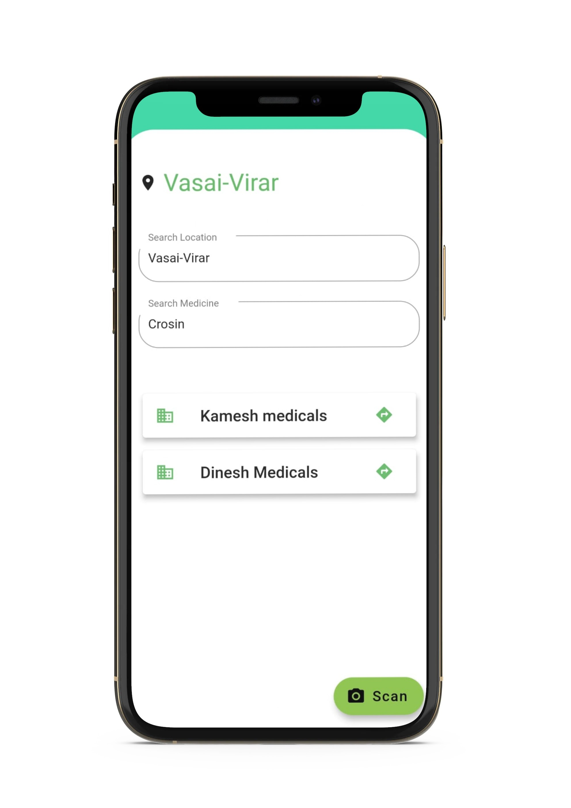
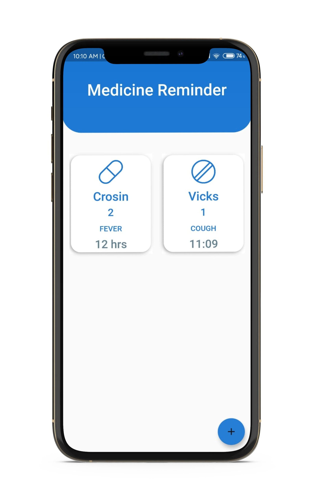
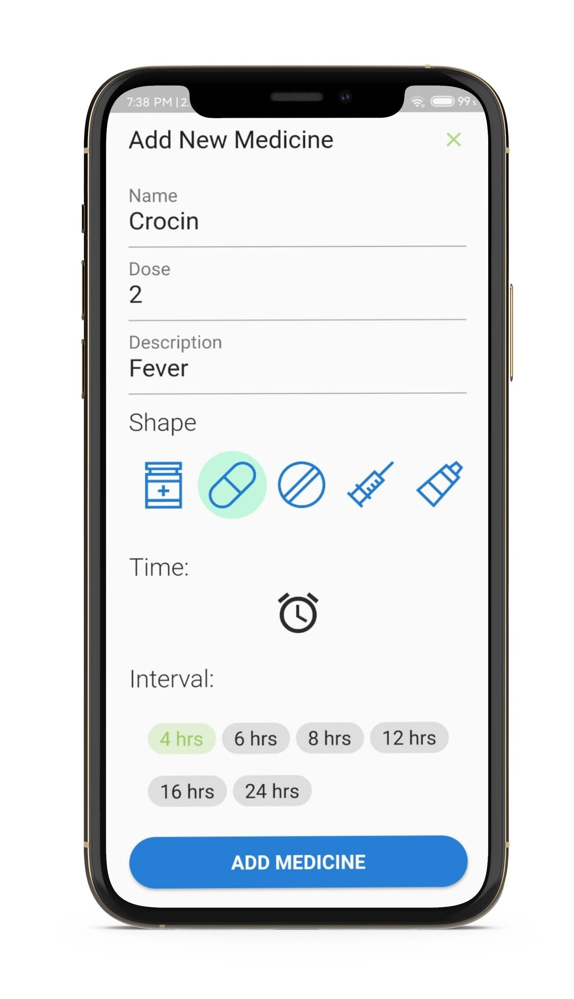
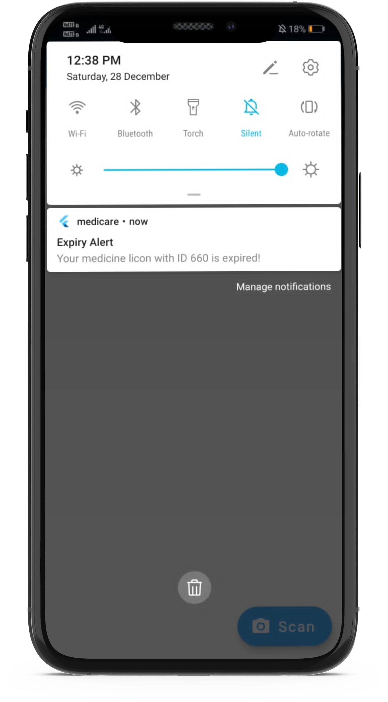

# Medicare-App-and-Website
* All in One Solution for Supply Chain Management for pharma industry using Blockchain.
* Website for the manufacturer,distributers,retailers to update the status of medicine using BlockChain at every stage of the supplychain.
* Flutter App for the consumers to check the expiry of medicine, track & trace the medicine ,check the details of medicine,etc. by scanning the BarCode on the medicine.

## System Architecture :computer: :rocket:
 

 

## App for The Consumers :iphone:

Login Page | Home Page
------------ | -------------
 | 

After Scanning Medicine | Medicine Tracking
------------ | -------------
 | 

Medicine Information | Checking Stock in Nearby Stores
------------ | -------------
 | 

### Medicine Reminder 

   

### Notifications For Medicine Expiry and Reminders

  
 

## Website For Manufactures,Retailers and Distributers :computer:
 
  
 
  
 
  
 
  
 
 
 
